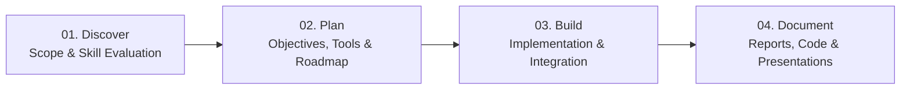

# Final-Year Project Support Website — Project Documentation & Specifications

> **Brand Promise**: *"Your idea. Our expertise. Let’s build it together."*

Updated service offering, visual identity, landing-page structure, and lead-generation plan for the **vitsnbolt** final-year project support platform.

---

## 1. Project Overview & Positioning

### Overview
The website promotes a dedicated project mentorship and development service tailored for students working on final-year, capstone, research, software, AI, and IoT projects. The team helps students develop their initial concepts, investigate existing literature and systems, identify opportunities for improvement, and plan and implement practical, high-quality technical solutions.

### Primary Website Goal
Convert student visitors into potential clients or mentees through a clear call-to-action (CTA) that links directly to an intake Google Form. The initial release does not require a complex user dashboard or account management system; rather, it prioritizes a polished, fast, responsive landing page that communicates credibility and effortlessly captures project inquiries.

### Brand Positioning
A practical, hands-on project-support team helping students bridge the gap between an early idea or research problem and a planned, developed, and well-documented solution through technical mentorship and implementation support.

---

## 2. Visual Identity & Design System

### Visual Direction
The design draws inspiration from classic barbershop character: dark slate signage and trim, warm wood tones, bronze lettering, and marble/stone neutrals—balanced with modern teal accents to signal technology, precision, and innovation.

### Color Palette

| Color Name | Hex Code | Role | Usage Guidance |
| :--- | :--- | :--- | :--- |
| **Dark Slate Grey** | `#2D3741` | Primary Foundation | Hero overlay, header, footer, primary button backgrounds, and dark section containers. |
| **Light Grey / Beige** | `#D0CFC8` | Main Neutral | Background panels, section breaks, borders, and subtle card surfaces. |
| **Bronze / Gold** | `#AE824B` | Primary Accent | Headlines, key highlights, icons, dividers, and decorative accents. |
| **Light Brown** | `#A26B38` | Warm Secondary Accent | Warm cards, labels, category badges, and selected callouts. |
| **White** | `#FFFFFF` | Contrast & Breathing Room | Text on dark slate, card interiors, whitespace, and clean reading areas. |
| **Teal** | `#185B6C` | Technology Accent | Links, secondary buttons, interactive hover/focus states, and tech badges. |

### Color Balance & Accessibility Rules
- **Recommended Balance**: Dark Slate Grey and White form the main structural pair; Light Grey/Beige is used for broad background panels; Bronze/Gold provides focal emphasis; Teal and Light Brown are used sparingly as supporting accents. Avoid using all six colors at equal intensity.
- **Accessibility & Contrast**:
  - Always verify WCAG AA compliance.
  - White text is suited for Dark Slate Grey (`#2D3741`) and Teal (`#185B6C`) backgrounds.
  - On Bronze (`#AE824B`) or Light Brown (`#A26B38`) surfaces, use Dark Slate Grey text unless contrast analysis proves otherwise.

### Typography & Imagery
- **Headings**: Confident, distinct display typeface for strong headings.
- **Body**: Highly legible, clean sans-serif typeface.
- **Imagery**: Genuine project photos, prototypes, system diagrams, hardware setups, and team images. Avoid generic stock photos that erode trust.

---

## 3. Core Service Offerings

1. **Machine Learning & AI Integration**
   - Helping students incorporate ML/AI capabilities into their academic projects.
   - Support spans selecting suitable models and algorithms, identifying libraries and toolchains, structuring data preprocessing pipelines, and deploying/integrating AI components into wider software or engineering applications.

2. **Focused Research on Existing Projects and Gaps**
   - Thorough review of existing literature, systems, studies, and open-source projects.
   - Uncovering limitations and research gaps to help students formulate well-defined research questions and distinct project scopes.

3. **Software & IoT Projects**
   - End-to-end design and development support for software-based systems and IoT prototypes.
   - Encompasses web/mobile applications, connected sensors, embedded controllers, microcontrollers (ESP32/Arduino/Raspberry Pi), and software-hardware integration.

4. **Software Integration into Existing Projects**
   - Developing software layers for projects that already feature hardware, engineering, or experimental setups.
   - Includes building user interfaces, analytical dashboards, local/cloud databases, REST APIs, and automation routines to maximize utility and presentation value.

5. **Mentorship & Idea Development**
   - Guiding students at various stages—from those with only an area of interest or rough concept to those with defined ideas.
   - Structured guidance in scoping, evaluating technical feasibility, selecting architecture, and building actionable development roadmaps.

---

## 4. Service Journey: Discover → Plan → Build → Document

1. **Discover**
   - Gain a deep understanding of the student's degree programme, academic requirements, interests, current concept, technical skill level, and constraints.
   - Mentor the student in exploring and refining workable technical directions.
2. **Plan**
   - Formulate clear problem statements, objectives, boundary scope, technology stacks, milestones, and development methodology.
   - Identify dependencies, hardware sourcing, datasets, and a realistic timeline.
3. **Build**
   - Deliver tailored implementation guidance, code snippets, hardware/IoT circuit schematics, dataset sourcing, AI model selection, and debugging support within agreed scope.
4. **Document**
   - Assist in structuring technical documentation, thesis chapters, methodology explanations, architectural diagrams, project reports, and final presentation slide decks.
   - Ensure the student thoroughly understands the technical underpinnings so they can confidently defend their project.

---

## 5. Recommended Landing-Page Structure

A focused, single-page layout designed to guide visitors naturally toward the inquiry Google Form.

| Section # | Section Name | Description & Key Components |
| :--- | :--- | :--- |
| **01** | **Navigation Bar** | Logo on left; clean navigation links (*Services*, *How It Works*, *About*, *Contact*); standout CTA button on right (*"Start Your Project"*). |
| **02** | **Hero Section** | High-impact headline, concise supporting paragraph, primary CTA (*"Tell Us About Your Project"*), secondary link (*"Explore Our Services"*), and contextual visual (prototype/workspace/code). |
| **03** | **Services** | Four core service cards with distinct icons, value descriptions, and target use cases: (1) AI & ML Integration, (2) Research & Gap Analysis, (3) Software & IoT, (4) Software Integration. |
| **04** | **How It Works** | 4-step linear progression: **Discover → Plan → Build → Document**, emphasizing student-centric collaboration. |
| **05** | **Why Work With Us** | Trust cards highlighting practical guidance, technical mentorship, research-backed planning, full-stack hardware/software capabilities, and transparent communication. |
| **06** | **Project Examples / Capabilities** | Showcase of real project archetypes, prototypes, system architectures, and case studies (with proper attribution and permission). |
| **07** | **FAQ** | Accordion answering common inquiries: target audience, prerequisites, typical timelines, cost models, scope limits, and difference between mentorship and implementation. |
| **08** | **Final CTA & Footer** | Re-iterated call-to-action banner leading to Google Form, direct contact information, team credentials, copyright, and social links. |

### Suggested Hero Copy
- **Headline**: *Bring Your Final-Year Project Idea to Life.*
- **Supporting Text**: *From AI and machine learning to software and IoT, we help students research, plan, build, and integrate practical solutions—with technical mentorship at every stage.*
- **Primary CTA Button**: *Tell Us About Your Project* (Links to Google Form)
- **Secondary CTA Link**: *Explore Our Services* (Smooth scrolls to Services section)

---

## 6. Lead Generation & Google Form Specification

The primary conversion mechanism is an intuitive, mobile-friendly Google Form.

| Form Area | Suggested Fields & Form Controls |
| :--- | :--- |
| **Contact Details** | • Full Name (Text) • Email Address (Email) • Phone / WhatsApp Number (Optional Text) • Preferred Contact Method (Dropdown / Radio) |
| **Academic Context** | • Institution / University (Text) • Programme / Department / Major (Text) • Academic Level / Year (Radio / Dropdown) • Project Submission Deadline / Target Date (Date picker) |
| **Project Stage** | • Single-choice Radio: &nbsp;&nbsp;- *I have a defined idea* &nbsp;&nbsp;- *I have a rough concept* &nbsp;&nbsp;- *I need mentorship to explore a direction* &nbsp;&nbsp;- *I have already started building* |
| **Project Description** | • Working Title or Topic (Text) • Problem being addressed and brief description of idea/current work (Long text) |
| **Support Required** | • Multi-select Checkboxes: &nbsp;&nbsp;[ ] AI / ML Integration &nbsp;&nbsp;[ ] Research & Gap Analysis &nbsp;&nbsp;[ ] Software Development (Web/Mobile/Desktop) &nbsp;&nbsp;[ ] IoT & Hardware Support (Sensors, Microcontrollers) &nbsp;&nbsp;[ ] Software Integration (APIs, Dashboards, DB) &nbsp;&nbsp;[ ] Planning & Mentorship &nbsp;&nbsp;[ ] Documentation & Presentation Guidance &nbsp;&nbsp;[ ] Other |
| **Current Progress & Tools** | • What has been done so far? Languages, frameworks, microcontrollers, datasets, or libraries currently in use (Long text) |
| **Challenges & Expectations** | • Main blocker or challenge faced (Long text) • What specific support is expected from the team? |
| **Consent & Agreement** | • Checkbox: *Permission to contact me regarding this inquiry and handle submitted project information for support assessment purposes.* |

---

## 7. Marketing Content, Messaging & Trust

### Messaging Strategy
- Lead with student outcomes: clarity of direction, achievable milestones, reduced stress, and technical competence.
- Demystify complex technical domains (AI, IoT, embedded systems) into accessible building blocks.
- Maintain ethical integrity: avoid unrealistic or prohibited academic guarantees (e.g. guaranteeing specific grades or automated completion). Focus strictly on **mentorship, technical guidance, and collaborative development**.

### Sample Marketing Taglines
> *"Have a concept but need technical direction?"*  
> *"Need AI, software, or IoT to work together in your project?"*  
> *"Let’s research the problem, plan the approach, and build with purpose."*

---

## 8. Development Checklist & Implementation Roadmap

- [ ] **Brand Identity**: Finalize logo assets, typography pairings, and brand assets.
- [ ] **Frontend Foundation**: Set up modern responsive HTML/CSS/JS or framework with the six-color palette.
- [ ] **Navigation & Hero**: Implement sticky/clean header and compelling hero section with dual CTAs.
- [ ] **Services Section**: Build 4 modular cards for the core services.
- [ ] **Process Journey**: Code the Discover → Plan → Build → Document workflow visualization.
- [ ] **Why Us & Trust**: Implement value props and verified capabilities.
- [ ] **FAQ Accordion**: Build accessible interactive FAQ component.
- [ ] **Google Form Integration**: Create and test the Google Form; verify all CTAs route seamlessly with UTM/tracking parameters.
- [ ] **Accessibility & Performance**: Test color contrast, Lighthouse scores (CWV, LCP), mobile responsiveness, and cross-browser support.
- [ ] **Footer & Contact**: Wire up footer links, direct contact options, and privacy disclosures.

---

### Closing Note
> **“Your idea. Our expertise. Let’s build it together.”**
